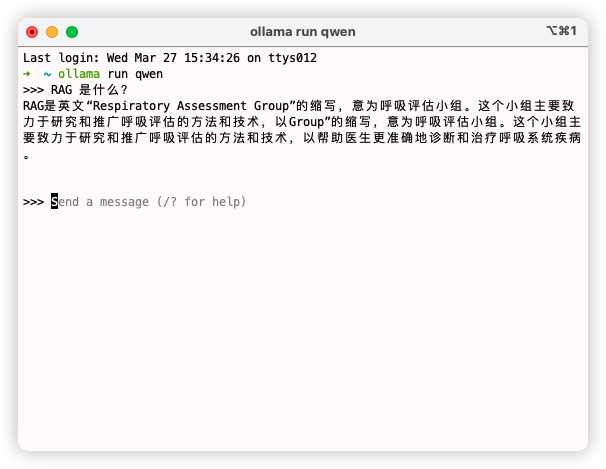

# langchain-rag-node-js

基于本地模型（Qwen） + langchain-Node 实现的本地知识库问答（RAG 应用） Demo。项目提供了本地模型的实践，实际上可以直接接入三方 API，例如 OPNEAI、通义千问等。这里不做赘述，感兴趣可以参考官方文档

[langchain - LLMs](https://js.langchain.com/docs/integrations/llms/)

# 环境配置

Mac Air M1

Mac OS Monterey

NodeJs v18.19.0

PNPM v8.14.0

Ollama v0.1.29 （models: qwen:7b）

Redis Stack v7.2

# 运行指南

1. 下载 Ollama 以及 LLM 模型。
> 官网: https://ollama.com/  ， 模型仓库：https://ollama.com/library



2. 部署 Redis Stack
> 官网: https://redis.io/download/

docker:
```sh
docker run -d --name redis-stack -p 6379:6379 -p 8001:8001 -e REDIS_ARGS="--requirepass mypassword" redis/redis-stack:latest
```

3. 安装依赖

```sh
pnpm i
```

4. 运行
```sh
node index.js
```